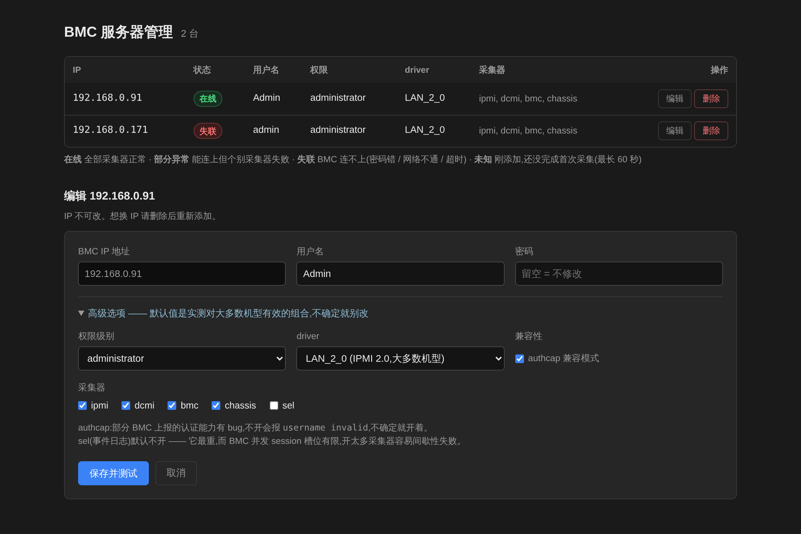
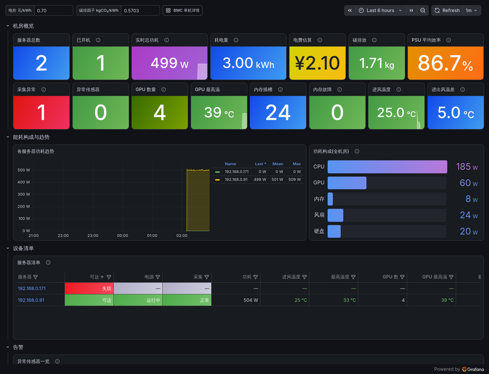
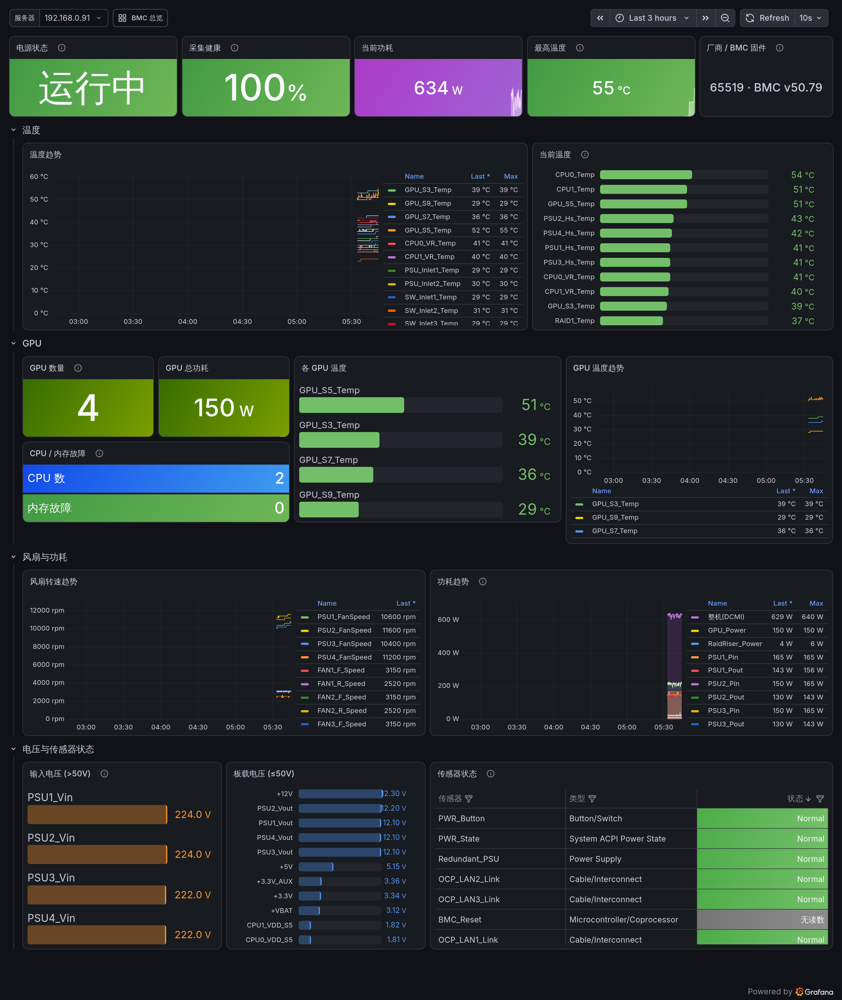
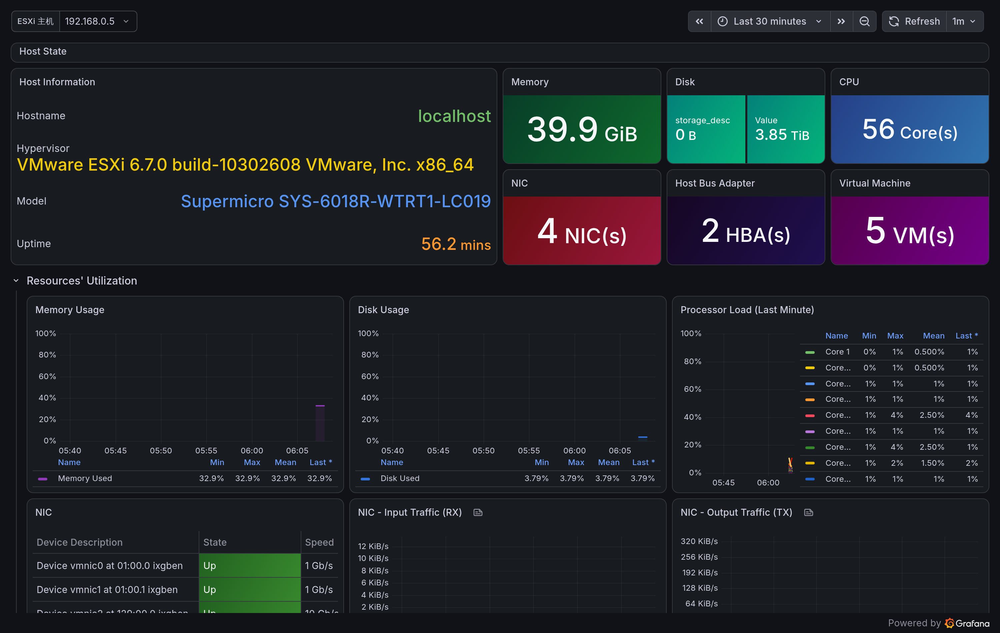

# bmc-monitor

> 服务器 BMC(IPMI)**带外监控**开箱方案 —— Prometheus + Grafana + ipmi_exporter,
> 外加一个网页,填 IP / 账号 / 密码就能把服务器加进看板,不用手改 YAML、不用重启任何服务。
>
> *Out-of-band server monitoring stack over IPMI. Add or remove machines from a web form —
> no YAML editing, no restarts. Ships with a DCIM-style fleet overview and a per-host detail dashboard.*

---

## 长什么样

### 服务器管理页

填 IP / 用户名 / 密码就能加一台机器,保存后**立刻返回真实的采集测试结果**。
状态区分「在线 / 部分异常 / 失联 / 未知」——**失联**(BMC 连不上)和**未知**(刚添加还没采集)
是两回事,混在一起会让真正的故障被忽略。



### 机房总览

功耗 / 耗电量 / 电费 / 碳排放 / PSU 效率 / 进风温度 / CPU / GPU,以及一张可点击下钻的服务器清单。

清单里 `192.168.0.251` 这台的功耗、GPU 列是 `—`:它的 BMC 不支持 DCMI 功耗读数,也没有 GPU。
**读不到就如实显示读不到**,不会拿 0 冒充。同理,BMC 连不上的机器会标红「失联」留在清单里,
而不是从表里消失 —— 那才是最需要被看见的情况。



### 单机详情

按 温度 / GPU / 风扇与功耗 / 电压与传感器状态 分区。



### ESXi 主机(可选)

如果机器上跑的是 VMware ESXi,可以额外用 Telegraf 通过 SNMP 采集虚拟化层:
CPU/内存/数据存储用量、网卡吞吐、HBA、以及每台虚拟机的 CPU/内存/开关机状态。
和 BMC 监控互补 —— 一个看硬件,一个看虚拟化层。



---

## 这是什么

监控服务器有两条路:

- **带内(in-band)**:在操作系统里装 agent(node_exporter 等)。能拿到 CPU 使用率、内存占用、磁盘 IO。
- **带外(out-of-band)**:通过服务器的 BMC 管理口(iDRAC / iLO / IPMI)采集。**不需要在被监控机器上装任何东西**,机器关机了照样能读到温度、电源状态、风扇。

这个项目做的是**带外**那条路。适合:机房里一堆服务器、不方便逐台装 agent、或者就是想看硬件层面的健康状况(温度、风扇、电压、电源、GPU 温度)。

## 功能

- **网页化增删服务器** —— 填 IP、用户名、密码,点保存,**立刻返回真实的采集测试结果**。失败会直接告诉你大概率是密码错还是 driver 选错,不用去翻日志。
- **每台机器独立账号密码** —— 不要求全机房统一凭据。
- **加/删机器零重启** —— 靠 ipmi_exporter 的热加载(`POST /-/reload`)和 Prometheus 的 `file_sd`,全程不打断其他机器的采集。
- **删除即清空历史** —— 删掉的机器,历史数据立刻从 Prometheus 里抹掉,不留残影(可选,需要 admin API)。
- **两个看板**:
  - **总览** —— 机房级视角:总功耗、耗电量、电费、碳排放、PSU 效率、进风温度、ΔT、GPU/内存概况,以及一张可点击下钻的服务器清单。
  - **单机详情** —— 温度 / GPU / 风扇 / 功耗 / 电压 / 传感器状态,按区分组。

## 快速开始

需要:Docker + Docker Compose,以及一台能路由到 BMC 管理网段的机器(IPMI over LAN 走 UDP 623)。

```bash
git clone https://github.com/<your-account>/bmc-monitor.git
cd bmc-monitor

cp .env.example .env
cp ipmi_exporter/ipmi.yml.example ipmi_exporter/ipmi.yml
cp prometheus/targets/bmc-targets.json.example prometheus/targets/bmc-targets.json

# 改一下 Grafana 管理员密码
$EDITOR .env

docker compose up -d --build
```

然后:

| 服务 | 地址 | 用途 |
|---|---|---|
| **bmc-manager** | http://<主机IP>:8080 | **在这里添加服务器** |
| Grafana | http://<主机IP>:3000 | 看板(admin / `.env` 里的密码) |
| Prometheus | http://<主机IP>:9090 | 排查采集问题 |

打开 8080,填入 BMC 的 IP、IPMI 用户名和密码,保存。页面会立刻告诉你能不能采到数据,十几秒后 Grafana 上就有图了。

### 把看板分享给同事

Grafana 默认开了**匿名只读**:同事点开链接**不用登录**就能看,但改不了任何东西(Viewer 角色,
增删改一律 403)。你自己要编辑时,从右上角登录 admin 即可。

⚠️ 一定要把 `.env` 里的 `GRAFANA_ROOT_URL` 改成这台机器的真实地址。留着 `localhost`
的话,「分享」按钮给出的链接是 `http://localhost:3000/...`,别人打开是空白;
页面内部的跳转和资源也会指向 localhost,表现为**打开很久才出数据**。

## 架构

```
   浏览器 ──▶ bmc-manager (Flask, :8080)
                  │ 原子写入
                  ├──▶ ipmi_exporter/ipmi.yml          (各 BMC 的账号密码)
                  ├──▶ prometheus/targets/*.json       (抓取目标, file_sd)
                  │
                  ├──▶ POST ipmi-exporter/-/reload     (热加载凭据,不重启)
                  └──▶ GET  ipmi-exporter/ipmi?...     (保存后立刻实测一次)

   ipmi_exporter ──UDP/623──▶ 各服务器 BMC
        ▲
   Prometheus (file_sd 自动发现目标变化,无需 reload)
        ▲
   Grafana
```

两个关键点:

1. **ipmi_exporter 支持 `SIGHUP` / `POST /-/reload` 热加载**(源码里有,README 未记载),所以改凭据不用重启容器。
2. **Prometheus 的 `file_sd` 通过 inotify 监听目标文件**,增删机器完全不需要动 `prometheus.yml`,也不需要 reload Prometheus。

## 一些实现上的注意点

这些是踩过坑之后固化下来的,改代码前值得看一眼:

- **配置文件必须以「目录」挂进容器,不能挂单个文件。** bmc-manager 用「临时文件 + 原子替换」写配置(避免进程被 kill 时留下半截文件导致凭据全丢),而原子替换会产生新的 inode;Docker 的单文件 bind mount 绑的是 inode,替换后容器里看到的会永远是旧文件。
- **BMC 的 IPMI session 槽位有限。** 采集器开太多、抓得太频繁,会把 session 表打满,表现为间歇性的 `command invalid or unsupported`。默认只开 `ipmi/dcmi/bmc/chassis` 四个(不开最重的 `sel`),抓取间隔 15s —— 实测一台正常机器抓一轮约 1.1 秒,占空比不到 10%,不会打满 session。`ipmi_scrape_duration_seconds` 可以看你自己机型的实际耗时,据此调整。
- **不同厂商 BMC 差异很大。** 有的需要 `authcap` workaround(否则报 `username invalid`),有的只支持 IPMI 1.5(`driver: LAN`)。网页的「高级选项」里都能按机器单独调。
- **数 CPU 个数不能只靠 `type="Processor"` 传感器。** 有的主板(实测超微)压根不上报这类传感器,整块板只有一个「机箱入侵」离散传感器。看板改为:先按 Processor 传感器数,数不到就退回按 `CPU1 Temp` / `CPU2 Temp` 这类温度探头数(正则做了锚定,不会把 `Vcpu1VRM Temp` 误算进去)。
- **Grafana 的值映射不做 `{{label}}` 插值**,只有 `legendFormat` 会。想在 stat 面板里拼接标签值(比如「厂商 · 固件版本」),要写进 `legendFormat` 再把 `textMode` 设成 `name`。
- **`CPU_TJMAX` / `TControl` 不是实测温度**,是 CPU 出厂标定的参考常量(常年 97°C 左右)。看板里已从"最高温度"中排除,否则温度永远报警。
- **机器关机后,大部分传感器会消失。** BMC 仍在线,但 CPU/GPU/风扇传感器不再上报,只剩待机的 PSU 进风温度和电池电压。看板对此做了空态处理,不会看起来像采集挂了。
- **进风温度取每台机器 inlet 传感器的最小值**,而不是平均值 —— `MB_Inlet` / `SW_Inlet` 这类机内探头比前面板热,取平均会算出负的 ΔT。
- **耗电量必须逐样本积分,不能用「平均功率 × 窗口时长」。** 后者对刚加入或中途删除的机器会严重高估:`avg_over_time` 只对**存在的样本**求平均,却乘以**整个时间窗口**,一台只跑了 1 小时的机器会被按 3 小时计费(实测高估 2.6 倍)。正确写法是 `sum_over_time(power[range]) * scrape_interval`,只统计真实采到数据的时间。看板顶部的「采集间隔 秒」变量必须与 `prometheus.yml` 里的 `scrape_interval` 保持一致。

## IPMI 拿不到的东西

别抱有不切实际的期待,以下几项**带外监控原理上做不到**,看板里也没有假装能做:

| 想要的 | 现实 | 要拿到得怎么办 |
|---|---|---|
| CPU / 内存使用率 | ❌ BMC 看不到操作系统内部 | 装 `node_exporter` |
| 内存容量 (GB) | ❌ 只有插槽健康状态 | 装 `node_exporter` |
| GPU 利用率 / 显存 | ❌ 只有 GPU 温度和整体功耗 | 装 `dcgm-exporter` |
| PUE | ❌ 需要机房配电和制冷数据 | 接机房配电柜 / 精密空调 |
| 内存条数 / 是否插满 | ❌ BMC 只上报插槽健康状态,空槽同样上报 | 装 `node_exporter` |
| 部分机型的整机功耗 | ⚠️ 不是所有 BMC 都支持 DCMI 功耗读数 | 看机型;不支持就只能从 PDU 侧取 |
| 机型 / 序列号 | ❌ 在 FRU 数据里,ipmi_exporter 不采集 FRU | `ipmitool fru` 手动查 |

带内和带外是互补的,不是替代关系。

## ESXi 监控(可选)

采集链路:`Telegraf --SNMP v3--> ESXi`,Telegraf 用 `prometheus_client` 暴露 `/metrics`,
由本项目现有的 Prometheus 直接抓 —— **不需要 InfluxDB**。
配置基于 [marjan-mesgarani/Telegraf-Config-Files](https://github.com/marjan-mesgarani/Telegraf-Config-Files/tree/main/ESXi%20Hypervisor),
看板是 [Grafana 18839](https://grafana.com/grafana/dashboards/18839)(已内置,做了两处改造见下)。

**1. 在 ESXi 上启用 SNMP v3**(默认是关的)。先在 `.env` 里填好 `ESXI_HOST` 和三个 SNMP 变量,然后:

```bash
docker run --rm --network host \
  -v "$PWD/telegraf/setup_snmp.py:/setup.py:ro" --env-file .env \
  -e ESXI_PW='<你的 ESXi root 密码>' \
  python:3.12-slim sh -c 'pip install -q paramiko && python /setup.py'
```

脚本只做加法:建一个专用的只读 SNMP v3 用户(SHA1 + AES128)并放行 161 端口。
回滚:`esxcli system snmp set --enable false`。

**2. 起 Telegraf**:`docker compose up -d telegraf`,然后 Grafana 里打开「ESXi 主机 (SNMP)」。

### 踩过的两个坑

- **上游配置只给 `hr_processor` 加了 `index_as_tag = true`,其余表都漏了。** SNMP 表的每行必须有唯一标识,否则同一张表所有行的 tag 完全相同,在 Prometheus 输出时互相覆盖 —— 实测 5 台虚拟机只出 1 条、9 个数据存储只出 1 条。本项目的配置给 `if_nic`/`ifx_nic`/`hr_storage`/`vmw_hba`/`vmw_vm` 都补上了。
- **输出必须用 `metric_version = 1`。** 看板靠 `storage_desc="Real Memory"`、`vm_state="powered on"` 这类 **label** 过滤,而这些在 SNMP 里是字符串字段;`metric_version = 1` 会把字符串字段转成 label,换成 `2` 会直接丢掉,看板大面积没数据。
- 看板原本把 `agent_host="ESXI.test.com"` **写死**在每条查询里,本项目已改成 `$esxi_host` 变量 + 下拉框。

### ESXi SNMP 读不到的东西

- **虚拟机的客户机操作系统需要装并运行 VMware Tools。** 没装的会报 `E: tools not installed`,看板里的 Windows/Linux 分类就统计不到它。
- SNMP 给的是**容量和状态**,不是性能明细。要单台虚拟机的 CPU ready、磁盘延迟这类,得换 Telegraf 的 `inputs.vsphere`(走 vSphere API,用 root 账号)。

## 告警通知(可选)

默认告警会进入 Alertmanager(http://<主机IP>:9093),但不推送到任何群。想在钉钉或企业微信群收到告警:

1. 创建一个群机器人:
   - **钉钉**:群设置 -> 机器人 -> 自定义,推荐「加签」方式(把密钥填到 `DINGTALK_SECRET`);
   - **企业微信**:群 -> 右上角 -> 群机器人 -> 添加,推荐勾选「自定义关键词」并把关键词设为「告警」。
2. 把 Webhook 地址填到 `.env` 里(`DINGTALK_WEBHOOK` / `WECHAT_WEBHOOK`,二选一或都填),然后:

```bash
docker compose up -d --build alert-webhook
```

改完配置想立刻验证有没有生效,发一条测试消息:

```bash
curl -X POST http://<主机IP>:5001/test
```

返回 `{"ok": true, "results": {"企业微信": "ok"}}` 就说明链路是通的。转发服务自身的运行状态(成功/失败次数、最后发送时间)由 Prometheus 抓取,对应告警规则 `AlertWebhookDown` / `AlertDeliveryFailed` 会在转发服务挂了或 webhook 失效时通知你。

内置告警规则在 `prometheus/rules/ipmi.yml`:BMC 失联、部分采集器失败、CPU/GPU 温度 > 90°C、风扇/电源/内存传感器异常。想调阈值或加规则,改这个文件后 `docker compose restart prometheus` 即可。

## 安全性

这套东西默认是**内网信任模型**,请不要直接暴露到公网:

- Grafana(3000)是**匿名只读**,这是刻意的 —— 方便分享看板。但 bmc-manager(8080)和
  Prometheus(9090)**没有任何认证,而且能改能删**。
- bmc-manager 放到公网 = 任何人都能读到你的服务器清单、删除监控、清空历史数据。
  **只把 3000 端口对外,8080/9090 务必限制在内网。**
- Prometheus 开了 `--web.enable-admin-api`(为了实现"删除即清空历史"),这个接口能删任意历史数据,同样没有认证。
- **BMC 密码在 `ipmi.yml` 里是明文** —— 这是 ipmi_exporter 的限制,它不支持从单独的文件读密码。程序会把这个文件的权限收紧到 `0600` 并 chown 给 exporter 的 uid(65534),宿主机上其他用户读不到;但 root 和容器内仍然能读。
- `.env`、`ipmi.yml`、`bmc-targets.json`、`.snmp-creds` 都已在 `.gitignore` 里,**不要把它们提交上来**。
- ESXi 的 SNMP v3 用的是**独立生成的随机密码**,不复用 ESXi root 密码;SNMP v3 全程加密(SHA1 认证 + AES128 加密)。

如果需要暴露到更大的范围,至少加一层反向代理 + 认证。

## 目录结构

```
.
├── docker-compose.yml
├── bmc-manager/              # 网页管理服务 (Flask)
│   ├── app.py
│   ├── Dockerfile
│   ├── requirements.txt
│   └── templates/index.html
├── ipmi_exporter/
│   └── ipmi.yml.example      # 复制为 ipmi.yml;之后由网页维护
├── prometheus/
│   ├── prometheus.yml
│   └── targets/
│       └── bmc-targets.json.example
└── grafana/provisioning/
    ├── datasources/datasource.yml
    └── dashboards/
        ├── bmc-overview.json     # 机房总览
        └── bmc-detail.json       # 单机详情
```

## 组件版本

| 组件 | 版本 |
|---|---|
| [ipmi_exporter](https://github.com/prometheus-community/ipmi_exporter) | v1.10.1 |
| [Prometheus](https://prometheus.io/) | v3.13.1 |
| [Grafana](https://grafana.com/) | 13.1.1 |

## License

MIT
